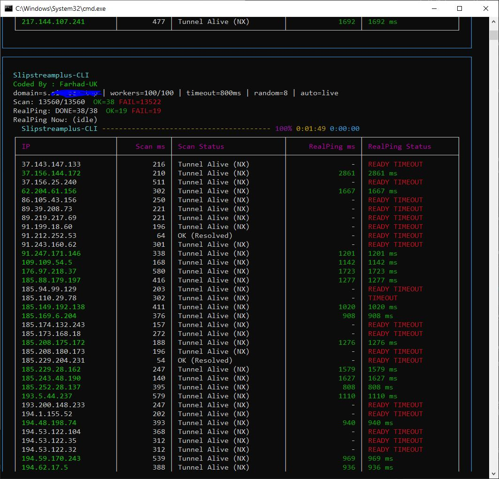

# Slipstreamplus-CLI
**Coded By : Farhad-UK**

Slipstreamplus-CLI is a powerful command-line (CLI) tool for **high-speed IP/CIDR scanning** and performing **real network latency tests (RealPing)** using Slipstream. ??
It provides a **live terminal dashboard** with progress, ETA, and tables, while also supporting **script-friendly output files**. ????

**????? | English:** [?????](#?????) | [English](#english)



---

## English

### ?? About Slipstream
Slipstream uses the DNS protocol to help you bypass strict restrictions and 2026-era whitelisting systems. ?????
It tunnels traffic in a way that can pass through networks where only DNS is allowed, providing a reliable path even under heavy filtering. ??

### ?? What Does This Tool Do?
1. Scans IP addresses or CIDR ranges using UDP/53 (DNS probing) ??
2. Detects IPs with active/working tunnels ?
3. Performs real latency tests (RealPing) on working IPs ??
4. Displays results live in terminal and/or saves them to files ??

### ? Features
- Fast IP and CIDR scanning (UDP/53) ?
- Optional random IP selection per CIDR ??
- Live terminal UI (progress bar, ETA, table) ??
- Shows only successful scan results in the table ?
- RealPing testing via Slipstream (END mode after scan) ??
- RealPing testing via Slipstream (LIVE mode during scan) ??
- Green highlight for successful RealPing results ??
- Flexible output options (scan OK / realtest OK) ???
- RealPing-only mode (no scan required) ??

### ?? Requirements

#### Using the EXE (Windows)
- Windows OS ??
- No Python required ?

#### Running from Source
- Python 3.10+ ??
- Install dependency:
```bash
pip install -r requirements.txt
```

### ?? Basic Usage

#### Show Help
```bash
slipscan_cli.exe --help
```

```bash
slipscan_cli.exe scan --help
```

```bash
slipscan_cli.exe realtest --help
```

### ?? Scan Command

#### Quick Run (LIVE RealPing + Save OK IPs)
```bash
slipscan_cli.exe scan --domain s.domain.top --file iran-ipv4.cidrs --random-per-cidr 8 --threads 100 --timeout-ms 800 --auto-realtest live --realtest-parallel 2 --realtest-slipstream-path .\slipstream-client-windows-amd64.exe --realtest-ok-out real_ok.txt --realtest-ok-format ip
```

#### Basic Scan with Live UI
```bash
slipscan_cli.exe scan --domain s.domain.com --file iran-ipv4.cidrs --random-per-cidr 8 --threads 100 --timeout-ms 800 --ui
```

#### Scan Without UI (script mode)
```bash
slipscan_cli.exe scan --domain s.domain.com --file iran-ipv4.cidrs --random-per-cidr 8 --threads 100 --timeout-ms 800
```

### ?? Input Methods

#### Using a File
File can contain IPs or CIDRs:
```
1.1.1.1
8.8.8.0/24
9.9.9.9
```

```bash
--file iran-ipv4.cidrs
```

#### Using Targets Directly
```bash
--targets 1.1.1.1 8.8.8.0/24
```

### ?? CIDR Random Selection
```bash
--random-per-cidr <number>
```

- `0` -> scan all IPs in the CIDR (can be very heavy) ??
- `>0` -> randomly select that many IPs from each CIDR ??

Example:
```bash
--random-per-cidr 8
```

### ?? RealPing Modes

#### END Mode (After Scan)
```bash
slipscan_cli.exe scan --domain s.domain.com --file iran-ipv4.cidrs --random-per-cidr 8 --threads 100 --timeout-ms 800 --ui --auto-realtest end --realtest-slipstream-path slipstream-client-windows-amd64.exe
```

#### LIVE Mode (During Scan)
```bash
slipscan_cli.exe scan --domain s.domain.com --file iran-ipv4.cidrs --random-per-cidr 8 --threads 100 --timeout-ms 800 --ui --auto-realtest live --realtest-parallel 2 --realtest-slipstream-path slipstream-client-windows-amd64.exe
```

Recommended options for LIVE mode:
```bash
--realtest-ready-ms 5000
--realtest-timeout-s 8
```

### ?? Output Options

#### Scan OK IPs (No RealPing)
```bash
--scan-ok-out scan_ok.txt
```

File output:
```
87.248.150.222
91.223.116.152
```

#### RealPing OK (IP Only)
```bash
--realtest-ok-out real_ok.txt --realtest-ok-format ip
```

```
87.248.150.222
91.223.116.152
```

#### RealPing OK (IP + Latency)
```bash
--realtest-ok-out real_ok_ipms.txt --realtest-ok-format ipms
```

```
87.248.150.222 2340
91.223.116.152 3078
```

### ?? RealTest Only (No Scan)
```bash
slipscan_cli.exe realtest --domain s.domain.com --file ips.txt --ui --slipstream-path slipstream-client-windows-amd64.exe --realtest-ok-out ok_ipms.txt --realtest-ok-format ipms
```

### ??? UI Notes
- Windows Terminal is recommended ?
- When `--ui` is enabled, text output is disabled by default ??
- Use `--stdout` to enable stdout output ??

### ?? Notes
- READY TIMEOUT means Slipstream could not initialize on that IP ?
- Large CIDRs without random selection can be very heavy ??
- LIVE mode waits for all queued RealPing tasks to complete ?

---

## ?????

### ?? ?????? Slipstream
Slipstream ?? ??????? ?? ?????? DNS ?? ??? ????? ?????? ?? ??????????? ???? ? ????????? Whitelisting (???? ????) ?? ?? ??? ???? ????? ??? ???? ????. ?????
??? ????? ?? ????????? ?????? ???? ??? ?????? ?? ?? ????????? ???? ??? ?? ??? DNS ?? ???? ???????? ? ??? ??? ???????? ????? ?? ???? ?????? ????? ??????. ??

### ?? ??? ????? ?? ???? ????? ???????
1. ???? IP ?? CIDR ?? UDP/53 (DNS probing) ??
2. ??????? IP???? ?? ???? ????/??????? ?
3. ????? ??? ????? ????? (RealPing) ??? IP??? ???? ??
4. ????? ???? ????? ?? ??????? ?/?? ????? ?? ???? ??

### ? ????????
- ???? ???? IP ? CIDR (UDP/53) ?
- ?????? ?????? IP ?? ?? CIDR (???????) ??
- ???? ?????? ???? ?? ??????? (???? ??????? ETA? ????) ??
- ????? ??? ????? ???? ?? ???? ?
- RealPing ?? Slipstream (???? END ??? ?? ????) ??
- RealPing ?? Slipstream (???? LIVE ??? ????) ??
- ??????? ??? ???? ????? ???? RealPing ??
- ????????? ??????????? (scan OK / realtest OK) ???
- ???? ??? RealPing (???? ???? ?? ????) ??

### ?? ??????????

#### ??????? ?? EXE (??????)
- ?????? ??
- ???? ???? ?? ?????? ?

#### ???? ?? ????
- Python 3.10+ ??
- ??? ???????:
```bash
pip install -r requirements.txt
```

### ?? ??????? ????

#### ????? ??????
```bash
slipscan_cli.exe --help
```

```bash
slipscan_cli.exe scan --help
```

```bash
slipscan_cli.exe realtest --help
```

### ?? ????? Scan

#### ????? ???? (RealPing ???? + ????? OK)
```bash
slipscan_cli.exe scan --domain s.domain.top --file iran-ipv4.cidrs --random-per-cidr 8 --threads 100 --timeout-ms 800 --auto-realtest live --realtest-parallel 2 --realtest-slipstream-path .\slipstream-client-windows-amd64.exe --realtest-ok-out real_ok.txt --realtest-ok-format ip
```

#### ???? ???? ?? ???? ????
```bash
slipscan_cli.exe scan --domain s.domain.com --file iran-ipv4.cidrs --random-per-cidr 8 --threads 100 --timeout-ms 800 --ui
```

#### ???? ???? UI (???? ???????)
```bash
slipscan_cli.exe scan --domain s.domain.com --file iran-ipv4.cidrs --random-per-cidr 8 --threads 100 --timeout-ms 800
```

### ?? ??????? ?????

#### ??????? ?? ????
???? ???????? ???? IP ?? CIDR ????:
```
1.1.1.1
8.8.8.0/24
9.9.9.9
```

```bash
--file iran-ipv4.cidrs
```

#### ???? ???? ?????? ?????
```bash
--targets 1.1.1.1 8.8.8.0/24
```

### ?? ?????? ?????? CIDR
```bash
--random-per-cidr <number>
```

- `0` -> ???? ??? IP??? CIDR (???? ????? ???) ??
- `>0` -> ?????? ?????? ???? ????? IP ?? ?? CIDR ??

????:
```bash
--random-per-cidr 8
```

### ?? ???????? RealPing

#### ???? END (??? ?? ????)
```bash
slipscan_cli.exe scan --domain s.domain.com --file iran-ipv4.cidrs --random-per-cidr 8 --threads 100 --timeout-ms 800 --ui --auto-realtest end --realtest-slipstream-path slipstream-client-windows-amd64.exe
```

#### ???? LIVE (??? ????)
```bash
slipscan_cli.exe scan --domain s.domain.com --file iran-ipv4.cidrs --random-per-cidr 8 --threads 100 --timeout-ms 800 --ui --auto-realtest live --realtest-parallel 2 --realtest-slipstream-path slipstream-client-windows-amd64.exe
```

????????? ???????? ???? LIVE:
```bash
--realtest-ready-ms 5000
--realtest-timeout-s 8
```

### ?? ????????

#### Scan OK (???? RealPing)
```bash
--scan-ok-out scan_ok.txt
```

????? ????:
```
87.248.150.222
91.223.116.152
```

#### RealPing OK (??? IP)
```bash
--realtest-ok-out real_ok.txt --realtest-ok-format ip
```

```
87.248.150.222
91.223.116.152
```

#### RealPing OK (IP + ?????)
```bash
--realtest-ok-out real_ok_ipms.txt --realtest-ok-format ipms
```

```
87.248.150.222 2340
91.223.116.152 3078
```

### ?? ??? RealTest (???? ????)
```bash
slipscan_cli.exe realtest --domain s.domain.com --file ips.txt --ui --slipstream-path slipstream-client-windows-amd64.exe --realtest-ok-out ok_ipms.txt --realtest-ok-format ipms
```

### ??? ???? UI
- Windows Terminal ??????? ?????? ?
- ???? `--ui` ???? ???? ????? ???? ??????? ??????? ??????? ??? ??
- ???? ????????? stdout ?? `--stdout` ??????? ???? ??

### ?? ????
- READY TIMEOUT ???? Slipstream ??? ?? IP ?????????? ???? ??? ?
- CIDR??? ???? ???? ?????? ?????? ????????? ???? ????? ????? ??
- ???? LIVE ????? ????? ??? ?????? RealPing ??????? ?
